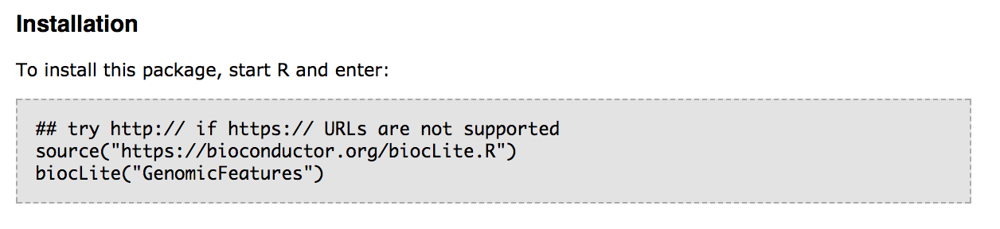
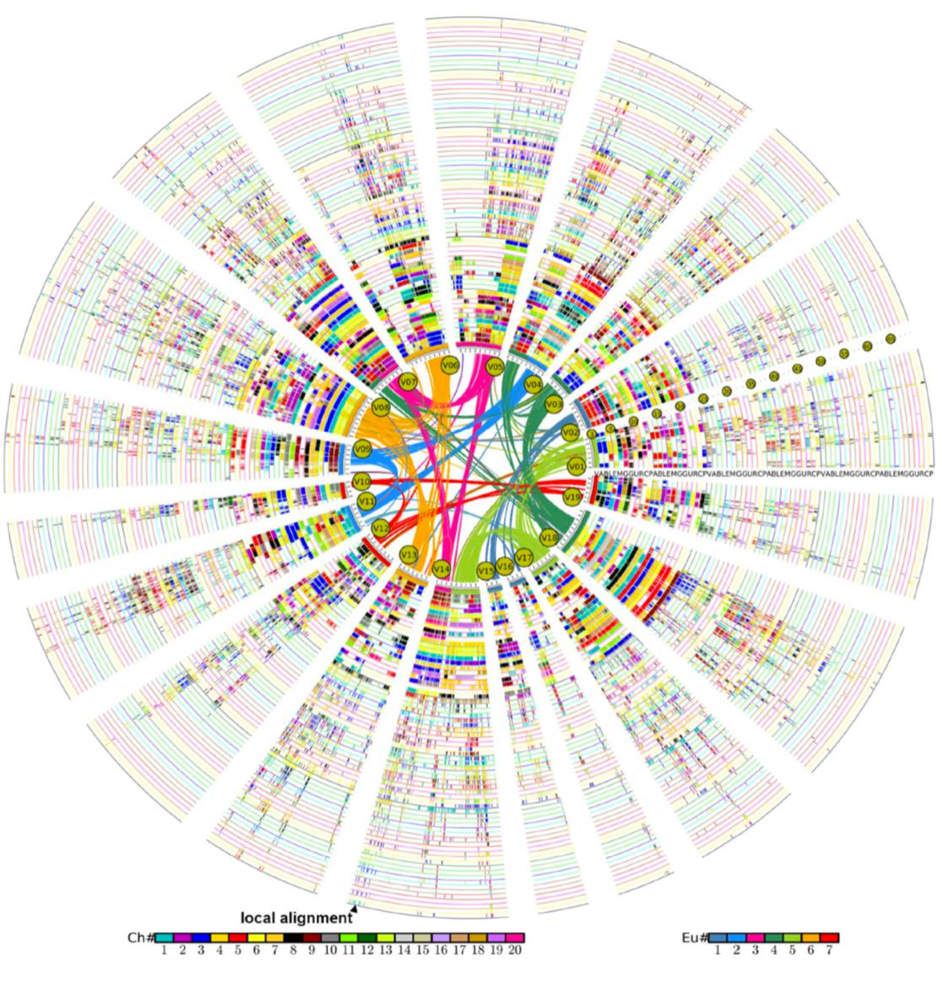
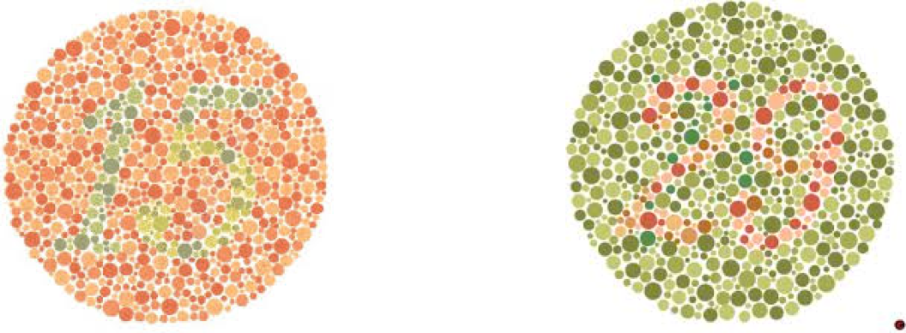
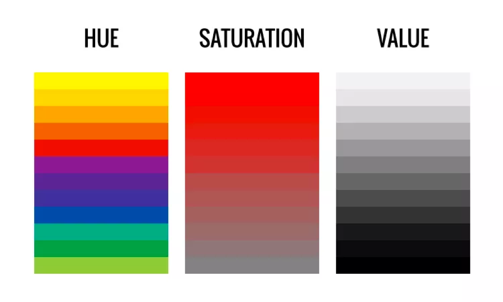
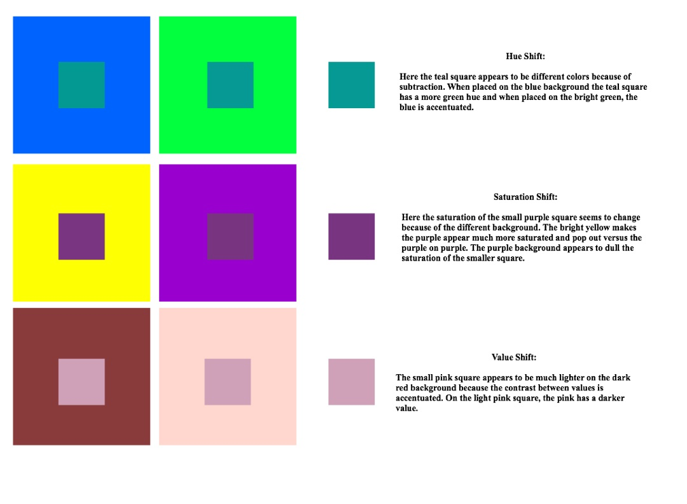
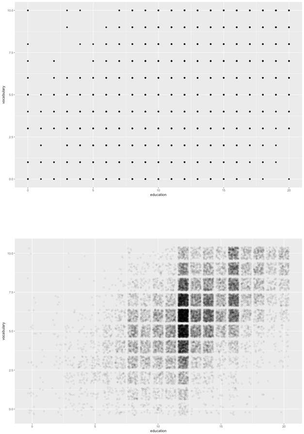
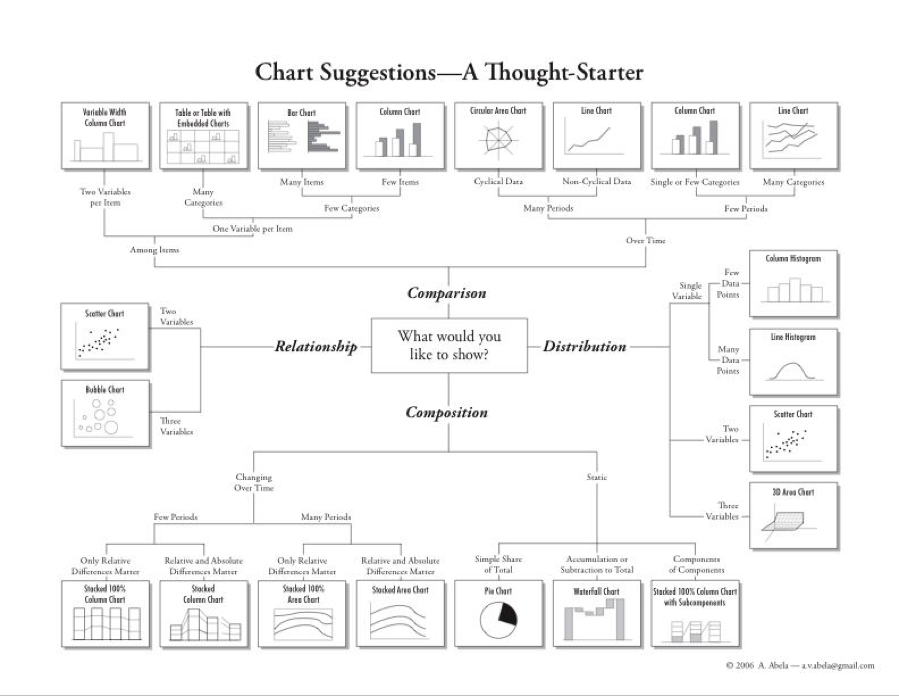

h# Brief introduction to the syntax of R

## Variables

### Assigning values to variables

Variables are extremely handy. Store a value or an object as a single word.   
```{r}
x <- 43 # a number
y <- "hello" # a word/character
```
Variable names **can not** contain spaces or special characters. They also can't start with a number.   

    <- used to assign values to variables

> **Assign values to variables**  

Create a list of different animals (barnyard and household animals) each with a different value. 
```{r, eval = FALSE}
horses <- 
cows <- 
chickens <- 
sheep <-
dogs <-
cats <- 
goldfish <- 
```

```{r, results = "hide", echo = FALSE}
horses <- 9
cows <- 32
chickens <- 19
sheep <- 24
dogs <- 2
cats <- 6
goldfish <- 4
```

### Variables can be used like values
Can use the variables instead of values to perform mathematical operations. R will replace the variable name with the value it represents. 

```{r, eval = FALSE}
farmyard <- horses + cows + chickens + sheep
farmyard
```

```{r, eval = FALSE}
household <- dogs + cats + goldfish
household
```

```{r, eval = FALSE}
farmyard/household
```


### Displaying values of variables

There are two ways to do this:

1. Type the variable name in R
```{r}
dogs
```

2. Use **print()** function
```{r}
print(dogs)
```

> **Print values to console**  

```{r, eval = FALSE}
horses

print(cows)

print(farmyard)
```

> **Test out tab completion on already created variables**

```{r, eval = FALSE}


```

## Data Frame
Two dimensional object that include both rows and columns. Columns are variables and rows are the observations. Each column can have a different data type. 

    data.frame() used to create a data frame

Use a data set that is in data.frame format which is preloaded into R called "iris". For more information about this dataset, see [here](https://stat.ethz.ch/R-manual/R-devel/library/datasets/html/iris.html).

Print the entire dataset to screen        
```{r, eval = FALSE}
iris
```
This is not really recommended if you have large data frames. 

Print the first 6 rows, or the head of the data frame.       

**head()** in R is performing the same basic function as head in UNIX, however here we are only viewing the top 6 lines of the data, and the data that we want to see must be surrounded by parentheses.       
```{r}
head(iris)
```

Print the last 6 rows, or the **tail** of the data frame.       
Again, the command the same as in UNIX, just with slightly different syntax.      
```{r}
tail(iris)
```

str() prints summary of the data.frame including data type of each column       
```{r}
str(iris)
```

**FOR THE GEEK**: How do you alter how many lines get printed with head() or tail()?      

    hint: help(head)

R counts from 1, whereas UNIX counts from 0. What does this mean? The first element in R is at index 1, where in UNIX this is index 0. 

### Retrive elements from a data.frame

Subsetting, or extracting, individual elements from a vector occurs by using square bracket notation **[ ]**. The brackets needs two pieces of information for a data frame, the row and column.

[1,1] =  returns the observation in the first row of the first column.  

[,1] = returns all rows in the first column. Notice that were did not specify a row element, which means to select all rows.        

[1,] = returns all columns for the first row. Notice the comma is still required.       

> Can you guess what these will return?   

```{r, results = "hide"}
iris[,2]
```

```{r, results = "hide"}
iris[4,]
```

```{r, results = "hide"}
iris[,"Species"]
```

```{r, results = "hide"}
iris[1:2,2]
```

```{r, results = "hide"}
iris[2:5,1:2]
```

```{r, results = "hide"}
iris[c(1,4,7), c(1,3)]
```

**FOR THE GEEK**: What do you think the which() command is doing?          
```{r, results = "hide"}
iris[which(iris$Sepal.Length < 7.5), ]
```
  
**FOR THE GEEK**: What does iris[1] return? How does this differ from iris[,1]         

### Datafame size

nrow() to find out the number of rows in the dataframe

```{r}
nrow(iris)
```

dim() returns the number of rows and columns 

```{r}
dim(iris)
```

colnames() returns the column names of the dataframe 

```{r}
colnames(iris)
```

Checking the size of data frame is helpful if you want to ensure all the data is being retain, you have the right number of rows/samples/columns that you expect. 

## Utilities
There is no need to rewrite a function that already exists in R, either in base R or in the vast amount of packages available for R. Built-in functions, those included with base R, are faster than re-writing them because they are actually written in C.       

Most of these built-in functions are related to stats, see [here](http://www.statmethods.net/management/functions.html) for more information. 

Get the sum for a column in a data frame
```{r}
sum(iris[,"Sepal.Length"])
```

Get the average (mean) for a column in a data frame
```{r}
mean(iris[,"Sepal.Length"])
```

Get the smallest value for a column in a data frame
```{r}
min(iris[,"Sepal.Length"])
```

Get the largest value for a column in a data frame
```{r}
max(iris[,"Sepal.Length"])
```

> **Play with built in functions**    

1. Get the standard deviation for Sepal.Width         
R syntax for standard deviation is sd()

```
```

```{r, echo=FALSE, results="hide"}
sd(iris[,"Sepal.Width"])
```

2. Get the median for Petal.Width  
R syntax for median is median()

```
```

```{r, echo=FALSE, results="hide"}
median(iris[,"Petal.Width"])
```

**FOR THE GEEK**: What doesn't this work?
```{r}
mean(airquality[,"Ozone"])
```
hint: help(mean)

## R packages
R is open source and easily expandable. Therefore **a lot** of people have contributed *packages* to R over the years. These are functions people have written to perform a wide variety of tasks. See [here](https://cran.r-project.org/web/packages/available_packages_by_name.html) for a long list of available packages.  There is also a biology specific repository called [BioConductor](http://bioconductor.org/packages/release/BiocViews.html#___Software).    

You can also contribute to R in the same way, by writing a package, but we will not be covering this in this course, but there is an entire book about it available [here](http://r-pkgs.had.co.nz/).

It is easy to install packages, and can be done via R. There are two general steps:

1. Install the package
This means downloaded the required code from the web repository. Packages may require other packages to work, therefore more than one package may download when installing a single package.   
          
    * install.packages("packagename") to install packagename

2. Load the package into R
Once the packages is downloaded, it then needs to be loaded into the R environment for use. Downloading the package does not make the commands available, it must be loaded into R first.    
                  
    * library(packagename) to load a package and make the commands available      
    

> **Go to Bioconductor page for GenomicFeatures**

http://bioconductor.org/packages/release/bioc/html/GenomicFeatures.html 

{width=250px} 

Install the Bioconductor package "GenomicFeatures" into R.

```{r, eval = FALSE}
source("https://bioconductor.org/biocLite.R")
biocLite("GenomicFeatures")
```

Load the "GenomicFeatures" library.

```{r, eval = FALSE}
library(GenomicFeatures)
```
**You only have to install the package once** (not once per script, just once), *but* you have to load the package every single time you want to use it (once per script).

A few other useful commands:

    installed.packages() to see what packages are installed 
    update.packages() to update installed packages

# Data Visualization

There are two different types of reasons to create a plot:    

1. **Exploratory Data Analysis**           
    
    + Making plots for *YOURSELF* to get to know the data      
    
2. **Explanatory Data Analysis**           

    + Making plots for *AUDIENCE* to communicate insights about the data    


Think about what your visualization is communicating. 

* Is it easy to interpret? 
* Is it clear the message? 
* Is it easy to extract out is meaningful? 
* What information is actually getting across to the reader?       

{width=250px}

## Things to think about when making plots
Humans read different information with differing levels of ease. This should be taken into account when creating a graphic. Make it easy for your reader to be able to interpret the information.        

{width=250px} 

It is also worth making graphics color blind friendly. There are numerous palettes within R/ggplot2 that have been created to help. See [here](http://www.cookbook-r.com/Graphs/Colors_(ggplot2)/#a-colorblind-friendly-palette) for more information.      

{width=250px} 

In general, for non-continuous traits, color should be used with caution.        

There are color have three traits: Hue, Saturation and Value. Hue is often used with categorical data, using different colors (meaning red and green) for different categories. Saturation refers to the intensity of the color, while Value refers to the lightness or darkness. 

{width=250px}

Color differentiation of Saturation and Value can be very difficult.      

Our perception of them can be skewed given the other colors around them. This makes it harder to accurately compare across graphs whether the color is the same or different.       

{width=250px}
   

## Overplotting    
Overplotting occurs when there are too many data points. It then becomes hard to see any information about density of data when all points are solid black dots. Information about the data becomes less clear with more data points.      
{width=250px} 

These plots were created using this code.
```{r, eval = FALSE}
library(car)

ggplot(Vocab, aes(x=education, y = vocabulary)) +
    geom_point()

ggplot(Vocab, aes(x=education, y = vocabulary)) +
    geom_jitter(alpha = 0.2, shape = 1, size = 1)
```

Overplotting is a huge issue when working with large datasets, but there are few things that you can do to attempt to minimize its effect.

1. Size  
    + Smaller points are easier to see
2. Shape  
    + Hollow circles objects are better
3. Jitter  
    + Adds random noise to x and y axis point
    + Makes it easier to see points that overlay
4. Alpha  
    + Alters the transparency
    + Allows you to see density

## Choosing a plot type
The type of plot used to visualize data depends on the type of data being plotted. Not all graphs are appropriate for all data types.       

{width=250px} 


# Annotate Peaks to Genes and Genomics Features

We will be using [Bioconductor](http://bioconductor.org/) to annotate our BED files. This utilizes multiple packages within Bioconductor, including [GenomicRanges](http://bioconductor.org/packages/release/bioc/html/GenomicRanges.html), [GenomicFeatures](http://bioconductor.org/packages/release/bioc/html/GenomicFeatures.html), [TxDb.Hsapiens.UCSC.hg19.knownGene](http://bioconductor.org/packages/release/data/annotation/html/TxDb.Hsapiens.UCSC.hg19.knownGene.html), [ChIPpeakAnno](http://bioconductor.org/packages/release/bioc/html/ChIPpeakAnno.html) and [ChIPseeker](http://bioconductor.org/packages/release/bioc/html/ChIPseeker.html).       

First we need to load the relevant libraries:   
```{r, results="hide", message=FALSE, warning=FALSE}
#source("https://bioconductor.org/biocLite.R")
#biocLite("GenomicFeatures")
#biocLite("TxDb.Hsapiens.UCSC.hg19.knownGene")
#biocLite("ChIPpeakAnno")
#biocLite("GenomicRanges")
#biocLite("ChIPseeker")

library(GenomicRanges)
library(GenomicFeatures)
library(TxDb.Hsapiens.UCSC.hg19.knownGene)
library(ChIPpeakAnno)
library(ChIPseeker)
```
The source and biocLite commands are commented out (using the **#** key), because the packages have already been downloaded onto the computers. They have a few dependencies and require a bit of time to download.    

Remember you just have to download a package once, but you have to load it (using the *library* command) every time (in every script) when you want to use it.      

## GRanges 

Need to translate our BED files into a [GRanges](http://bioconductor.org/packages/devel/bioc/vignettes/GenomicRanges/inst/doc/GenomicRangesIntroduction.pdf) dataset using [GenomicRanges](http://bioconductor.org/packages/release/bioc/html/GenomicRanges.html) GenomicRanges is a very powerful Bioconductor package aids in the representation of genomic data in R.  

Data are all from the  [ENCODE Project](https://www.encodeproject.org/). They are data from three different transcription factors (H3k4me3, H3k4me1, and H3k27ac) all from the same cell line (K562). Data can be found here for: [H3k4me3](https://www.ncbi.nlm.nih.gov/geo/query/acc.cgi?acc=GSM733680), [H3k4me1](https://www.ncbi.nlm.nih.gov/geo/query/acc.cgi?acc=GSM733692) and [H3k27ac](https://www.ncbi.nlm.nih.gov/geo/query/acc.cgi?acc=GSM733656).

To make a GRanges dataset, need to have chr, start and stop information. Strand information can also be incorporated. This is the exact basic format of a BED file. Extra columns can be include that contain information such as contiguous binding sites, transcripts, and exons. 

Importantly, they allow for *range based* operations to occur.  *Range based* operations include things like finding the overlaps between two files (i.e. chip peaks and gene locations).

Input the data and convert it into GRanges format. The command we are going to use to do this, *toGRanges*, comes from the ChIPpeakAnno Bioconductor library, and makes use of GenomicRanges functions.    

*Notice that we have to path to where the file is located on the computer*      
Pathing to file is the *same* as when we were using UNIX.    
```{r, results="hide", message=FALSE, warning=FALSE}
H3k4me3_K562 <- toGRanges("input/chr22_GSM733680_hg19.bed", 
                       format="BED", header = FALSE)
```
```{r, results="hide", message=FALSE, warning=FALSE}
head(H3k4me3_K562)
```

There will be an warning message in red saying "duplicated or NA names found. Rename all the names by numbers." This is okay for the time being, and informing us that we may have duplicate peaks which would require us to re-examine our MACS2 output. 

> **Load the other two datasets (H3k4me1, ZEB2) into R as GRange datasets**

Load chr22_GSM733692_hg19.bed as H3k4me1_K562

```{r, echo = FALSE, results="hide", message=FALSE, warning=FALSE}
H3k4me1_K562 <- toGRanges("input/chr22_GSM733692_hg19.bed",
                       format="BED", header = FALSE)
```

Load chr22_GSM733656_hg19.bed as H3k27ac_K562

```{r, echo = FALSE, results="hide", message=FALSE, warning=FALSE}
H3k27ac_K562 <- toGRanges("input/chr22_GSM733656_hg19.bed",
                       format="BED", header = FALSE)
```

## Genomic Features

GenomicFeatures library *"contains a set of tools and methods for making and manipulating transcript centric annotations"* GenomicFeatures work with TxDb.Hsapiens.UCSC.hg19.knownGene, which is a txdb object. A txdb object is a transcript database containing information about transcripts. This one has information about Homo sapiens data from UCSC build hg19 based on the knownGene Track. This will contain information about the genomic location of features like introns, exons, UTR regions, etc. 

Annotate the ChIPseq peak GRanges files with the TxDb.Hsapiens.UCSC.hg19.knownGene genomic features. 

First, load the transcript database into R, so it is available to use later on. 
```{r}
txdb <- TxDb.Hsapiens.UCSC.hg19.knownGene
```

## Annotate Peaks
Use the *annotatePeak* function in the *ChIPseeker* package. The is takes a few different options. The first is the GRanges file to be annotated, *tssRegion* is the regions around the TSS to be considered, *TxDb* is the transcript database used for the annotation, and *annoDb* is the annotation package. There are other options also available, see the [ChIPseeker manual](http://bioconductor.org/packages/release/bioc/manuals/ChIPseeker/man/ChIPseeker.pdf) for more information.     

Set the *tssRegion* to plus or minus 3000 bases, using the TxDb we have already download, and the annotation package [org.Hs.eg.db](http://bioconductor.org/packages/release/data/annotation/html/org.Hs.eg.db.html). Including org.Hs.eg.db adds information like gene name and symbol. 
```{r, results="hide", message=FALSE, warning=FALSE}
H3k4me3_K562_anno <- annotatePeak(H3k4me3_K562, tssRegion=c(-3000, 3000),
                               TxDb=txdb, annoDb="org.Hs.eg.db")
```

Convert the annotated peaks back into a GRanges object.
```{r, results="hide", message=FALSE, warning=FALSE}
H3k4me3_K562_anno <- as.GRanges(H3k4me3_K562_anno)
```
```{r, results="hide", message=FALSE, warning=FALSE}
head(H3k4me3_K562_anno)
```

Get a list of the column names for the annotated GRanges object.   
```{r}
names(mcols(H3k4me3_K562_anno))
```     

> **Annotate the other two datasets (H3k4me1, H3k27ac)**
Remember to convert them into a GRanges object. 

```{r, echo = FALSE, results="hide", message=FALSE, warning=FALSE}
H3k4me1_K562_anno <- annotatePeak(H3k4me1_K562, tssRegion=c(-3000, 3000),
                               TxDb=txdb, annoDb="org.Hs.eg.db")
H3k4me1_K562_anno <- as.GRanges(H3k4me1_K562_anno)
```

```{r, echo = FALSE, results="hide", message=FALSE, warning=FALSE}
H3k27ac_K562_anno <- annotatePeak(peak = H3k27ac_K562, tssRegion=c(-3000, 3000),
                               TxDb=txdb, annoDb="org.Hs.eg.db")
H3k27ac_K562_anno <- as.GRanges(H3k27ac_K562_anno)
```

# Bar plot of the number of peaks
Create a simple bar plot of the total number of peaks from each of the three factors.

Create a simple bar plot using the function *barplot*. The input is the *length* of the three datasets, the length indicating the total number of peaks for each dataset.      

*c()* creates a vector in R. Here *c()* is used to allow the 3 lengths to be a single input into the *barplot* command. *barplot* only allows one single input, therefore without using the *c()* an error would be thrown.       

*names* renames the labels on the x-axis. Again this is done using a vector created by using the *c()* command. The order of the data in the first instance **MUST** match the order in the second. Otherwise the bars will be mislabeled.     

```{r}
barplot(c(length(H3k4me3_K562), length(H3k4me1_K562), length(H3k27ac_K562)),
        names=c("H3k4me3", "H3k4me1", "H3k27ac"))
```

# Overlapping Peaks  
It is good to know how many peaks overlap. This can be between replicates, between the same TF in different cell types, between different TFs in the same cell type or between different TFs in different cell types. Quantifying the number of overlapping peaks is of interest. 

Use the *findOverlapsOfPeaks* function from the  ChIPpeakAnno packages. This allows the finding of overlap between 2 or more GRanges formatted file. You just list the input files for the command. 

```{r, results="hide", message=FALSE, warning=FALSE}
overlap_hits <- findOverlapsOfPeaks(H3k4me1_K562_anno, H3k27ac_K562_anno, H3k4me3_K562_anno)
```

*findOverlapsOfPeaks* returns a list, which contains multiple levels of datasets and information. See what is in overlap_hits by using the *names* function, which will return the names of all the different elements in the list.      
```{r}
names(overlap_hits)
```

For creating a venn diagram, interested in the information contain within *peaklist*. Again, see what is in this list by using the *names* function.       
```{r}
names(overlap_hits$peaklist)
```

Shows the names of our input data. The names that include ***///** are the overlapping peaks between the datasets, and the name alone the unique peaks.   
To make a venn diagram need to know the length of each of these datasets, which we can obtain using the length function and the appropriate path the data.    
```{r}
length(overlap_hits$peaklist[["H3k4me3_K562_anno"]]) 
length(overlap_hits$peaklist[["H3k4me1_K562_anno///H3k27ac_K562_anno"]])
length(overlap_hits$peaklist[["H3k4me1_K562_anno///H3k27ac_K562_anno///H3k4me3_K562_anno"]])
```

Use a package called *Vennerable* which creates weighted venn diagrams. The package is a little old but there are very limited weighted Venn packages for R. There is a manual for the package available [here](https://r-forge.r-project.org/scm/viewvc.php/*checkout*/pkg/Vennerable/inst/doc/Venn.pdf?revision=58&root=vennerable).

Install and load the package. The package already loaded, so just need to load the package using *library*. 
```{r, results="hide", message=FALSE, warning=FALSE}
#install.packages("Vennerable", repos="http://R-Forge.R-project.org")
library(Vennerable)
```

Using the *Venn* function, we are going to *SetNames* for the three different sets. The order is important as it must match the order in the *Weight* part of the commands. The *Weight* command is a bit complex, and get more complicated with the more datasets you are overlapping. Here with 3 datasets, the order in weights is:       

* Dataset1 
* Dataset2 
* Overlap of Dataset1 and Dataset2 
* Dataset3 
* Overlap of Dataset1 and Dataset3 
* Overlap of Dataset2 and Dataset3 
* Overlap of Dataset1 Dataset2 and Dataset3

There is one other commands that exist within the *plot* function that wraps around the *Venn* function. The *plot* function is needed as *Venn* does not produce a plot on its own, it needs the *plot* function to do this for it. *show = list(Faces = FALSE )* is an option in *plot* that removes the coloring of the individuals circles. If you prefer the circles and overlaps to be colored, change *FALSE* to *TRUE*.    

```{r}
plot(Venn(SetNames=c("H3k4me3", "H3k27ac", "H3k4me1"), Weight=c(0,
        length(overlap_hits$peaklist[[1]]), 
        length(overlap_hits$peaklist[[2]]),
        length(overlap_hits$peaklist[[3]]), 
        length(overlap_hits$peaklist[[4]]),
        length(overlap_hits$peaklist[[5]]),
        length(overlap_hits$peaklist[[6]]),
        length(overlap_hits$peaklist[[7]])
    )), show = list(Faces = FALSE ))

```

You can also extract the overlapping peaks into a new GRanges dataset.
```{r, results="hide", message=FALSE, warning=FALSE}
three_overlap <- overlap_hits$peaklist[["H3k4me1_K562_anno///H3k27ac_K562_anno///H3k4me3_K562_anno"]]
```
```{r}
head(three_overlap)
```

# Distribution around TSS
The annotated GRanges file now contain a column called *distanceToTSS*. Using the *density* function and *plot*, we can create a density plot for the location of peaks to the TSS. 

*main* option creates the title. 

```{r}
plot(density(H3k4me1_K562_anno$distanceToTSS), 
     main = "Distance to TSS\nfor H3k4me1 in K562")
```


We can also use a package called *ggplot2* to create a slightly more polished graphic. *ggplots* has its own syntax, has a [good online reference](http://ggplot2.tidyverse.org/reference/index.html), and widely used.  

First we have to load the ggplot2 package.
```{r, results="hide", message=FALSE, warning=FALSE}
#install.packages("ggplot2")
library(ggplot2)
```

The GRanges dataset can not be used as input into ggplot, but the *as.data.frame()* function will convert the GRanges object into a data frame, and this can be used as input into ggplot.

* *aes()* function is for what element you want to plot, here it is distanceToTSS                
* *geom_density()* tells ggplot we want to create a density plot of our *aes* (distanceToTSS)          
* *theme_bw()* changes the background color and alters the grid lines       
* *xlab* and *ylab* changes the x and y axis titles      
* *ggtitle* changes the title of the plot       

Notice that the lines of ggplot command are all linked together by a **+** sign.     
```{r}
ggplot(as.data.frame(H3k4me1_K562_anno), aes(x = distanceToTSS)) +
    geom_density(color = "red") +
    theme_bw() + 
    xlab("Distance to TSS") +
    ylab("Density") +
    ggtitle("Distance to TSS for H3k4me1 in K562")
```


> **Make a density plot for the other two datasets (H3k27ac, H3k4me3)**

```{r, echo = FALSE, eval = FALSE}
plot(density(H3k27ac_K562_anno$distanceToTSS), main = "Distance to TSS H3k27ac in K562")
```

```{r, echo = FALSE, eval = FALSE}
ggplot(as.data.frame(H3k27ac_K562_anno), aes(distanceToTSS)) +
    geom_density() +
    theme_bw() + 
    xlab("Distance to TSS") +
    ylab("Density") +
    ggtitle("Distance to TSS for H3k27ac in K562")
```

```{r, echo = FALSE, eval = FALSE}
plot(density(H3k4me3_K562_anno$distanceToTSS), main = "Distance to TSS H3k4me3 in K562")
```

```{r, echo = FALSE, eval = FALSE}
ggplot(as.data.frame(H3k4me3_K562_anno), aes(distanceToTSS)) +
    geom_density() +
    theme_bw() + 
    xlab("Distance to TSS") +
    ylab("Density") +
    ggtitle("Distance to TSS for H3k4me3 in K562")
```

```{r, echo = FALSE, eval = FALSE}
library(reshape2)
tss_list <- list(H3k4me1 = H3k4me1_K562_anno$distanceToTSS, H3k27ac = H3k27ac_K562_anno$distanceToTSS, H3k4me3 = H3k4me3_K562_anno$distanceToTSS)
n_tss_list <- sapply(tss_list, length)
tss_list_max <- seq_len(max(n_tss_list))
distance_TSS <- as.data.frame(sapply(tss_list, "[", i = tss_list_max))

distance_TSS_ggplot <- melt(distance_TSS)

ggplot(distance_TSS_ggplot, aes(x =  value, col = variable)) +
    geom_density() +
    theme_bw() + 
    xlab("Distance to TSS") +
    ylab("Density") +
    xlim(-30000, 30000)
```

# Heatmap for TSS
Create a heatmap to TSS. This will use functions within the **ChIPseeker** package.    

*getPromoters* function within **ChIPseeker**. This uses the txdb (transcription database) that we have already loaded and extracts the promoter region (area around TSS). The size of the area around the TSS that is extracted can be altered using the *upstream* and *downstream* options. Here, we are selecting 3000 bases on either side.    
```{r}
promoter <- getPromoters(TxDb=txdb, upstream=3000, downstream=3000)
```
This returns a GRanges object of promoter locations for the entire genome.     
```{r, results="hide", message=FALSE, warning=FALSE}
promoter
```

The *getTagMatrix* function integrates the GRanges file for peak information with the GRanges file for promoters. This takes the input for *getTagMatrix* a x-axis range (*xlim*), allows for color selection (*color*), and a plot *title*.  
```{r}
H3k4me1_K562_tagMatrix <- getTagMatrix(H3k4me1_K562, windows=promoter)

tagHeatmap(H3k4me1_K562_tagMatrix, xlim=c(-3000, 3000), color="red", 
           title = "Distance to TSS\nH3k4me1 in K562")
```

To make multiple plots on one screen, *par(mfrow=c(rows,columns))* tells R that you want to plot X number of rows and Y number of columns in the one plotting window. There always needs to be both a row and column number given.   

In the code below, we are plotting 1 row and 3 columns, for the 3 different TFs we are investigating. 
```{r}
par(mfrow=c(1,3))

H3k4me1_K562_tagMatrix <- getTagMatrix(H3k4me1_K562, windows=promoter)

tagHeatmap(H3k4me1_K562_tagMatrix, xlim=c(-3000, 3000), color="red", 
           title = "Distance to TSS\nH3k4me1 in K562")

H3k27ac_K562_tagMatrix <- getTagMatrix(H3k27ac_K562, windows=promoter)
tagHeatmap(H3k27ac_K562_tagMatrix, xlim=c(-3000, 3000), color="blue", 
           title = "Distance to TSS\nH3k27ac in K562")

H3k4me3_K562_tagMatrix <- getTagMatrix(H3k4me3_K562, windows=promoter)
tagHeatmap(H3k4me3_K562_tagMatrix, xlim=c(-3000, 3000), color="green", 
           title = "Distance to TSS\nH3k4me3 in K562")
```

Need to reset the plotting window, otherwise all subsequent plots that will be made will only use 1/3 of the plotting window. *dev.off* will close the plotting window, removing the plot and also any plotting parameters that have been set.    
```{r}
dev.off()
```

# Bar plot of genomic locations

Peaks can occur at other locations within the genome, not just around transcription (TSS). A stacked bar chart showing the frequency of different annotation locations for peaks. 

First we need to prepare the data for plotting. We are going to be using a library called [tidyr](http://tidyr.tidyverse.org/index.html) and [stringr](http://stringr.tidyverse.org/index.html), which is part of the [tidyverse](https://www.tidyverse.org/) set of packages. These packages are very good for manipulating data in R, particularly [dplyr](http://dplyr.tidyverse.org/).    
```{r, results="hide", message=FALSE, warning=FALSE}
#install.packages("tidyr")
#install.packages("stringr")
library(tidyr)
library(stringr)
```

Extract out just the annotations columns from the GRanges object, and save it as a new *data.frame* called *df*. This now is a dataframe with one column called *annotations*.    
```{r}
df <- data.frame(annotations=H3k4me3_K562_anno$annotation)
```
```{r, results="hide", message=FALSE, warning=FALSE}
head(df)
```

Notice that the new dataframe (*df*) has annotations like *Intron (uc002zks.4/uc002zks.4, intron 1 of 7)* and *Exon (uc002zlr.3/387590, exon 7 of 9)*. Really, we are only interested in the first part, before the parentheses (*Intron*, *Exon*, etc.). We need to remove the bit of information we do not want, and we can use the *separate* function from **tidyr** to do this. 

*separate* take as input:
* the dataframe (*df*)
* the column to manipulate in that dataframe (*annotations*)
* what delimiter you want to separate on (*sep=*)
* what you want to call the new columns (*into = *)
* if you want to drop excess splits (*drop = TRUE*)

Because we are separating by a parentheses, we need to use special formatting, as a parentheses is considered a special character. Therefore, we need to wrap the parentheses within square brackets for the split to work properly.     
```{r}
locations <- separate(df, annotations, 
                      sep = "[(]", into = c("annotation"), drop = TRUE)
```
```{r, results="hide", message=FALSE, warning=FALSE}
head(locations)
```
There will be a warning message about excess locations at numerous sites. This is okay in this instance as we only want to keep the first column of information.      
  
The separation has left a trailing white space. It is difficult to see, but trust me, it is there. We want to remove this trailing white space, and we can use the function *str_trim* from the **stringr** package to do this.    

*str_trim* takes as input the column you want to manipulate, which must include "string" (aka text/character) information. It also needs to know wher you want to trim the excess white space from: "left", "right", or "both".     

Because *str_trim* only works on a column of a dataframe (or a vector), the output must be to a column of a dataframe (or a vector), not to an entire dataframe. Here, we are outputting the results from the *str_trim* function to the **annotation** column for the dataframe **locations**, denoted using the syntax **locations$annotation**.   

We want to remove trailing white space, white space that is occuring after the word on the right hand side.     
```{r}
locations$annotation <- str_trim(locations$annotation, side = "right")
```
```{r, results="hide", message=FALSE, warning=FALSE}
head(locations)
```

Next we want to calculate the number of times each annotations occurs (its frequency). We can use the function *table* to do this. The default for table is to output a vector, however because we are going to plot the data using **ggplot2**, we want to output to be a data frame instead. Wrapping the *table* command in *as.data.frame* will convert the output from a vector into a data frame. 
```{r}
anno_freq <- as.data.frame(table(locations))
```
```{r, results="hide", message=FALSE, warning=FALSE}
head(anno_freq)
```

Below creates a color blind friendly color scheme for plotting. This is taken from [here](http://www.cookbook-r.com/Graphs/Colors_(ggplot2)/).    
```{r}
cbPalette <- c("#999999", "#E69F00", "#56B4E9", "#009E73", "#F0E442", "#0072B2", "#D55E00", "#CC79A7")
```

Use **ggplot2** to create a stacked bar plot and add a the frequency for each annotation to the plot. 

* *aes()* function is for what element you want to plot, here there are multiple elements:
    * *x* is blank, as we do not have an x axis element
    * *y* is the number of occurrences (*Freq*) plotted on the y-axis
    * *fill* is the genomic location annotations (*locations*), this will tell ggplot to fill the elements in with different colors
    * *label* is the number of occurrences (*Freq*), tells ggplot to create a numeric label for each annotation 
* *geom_bar()* tells ggplot we want to create a bar plot of our *aes*, with the following options:      
    * *width* how wide we want the bar plot to be   
    * *stat* tells ggplot how to plot the data - *identity* means plot the exact number given  
* *geom_text()* adds text to plot, linked to the *label* option within *aes*, this has some options:     
    * *size* how big the text should be    
    * *position* where the text should be located     
* *scale_fill_manual()* change the colors to used the color blind friendly palette we loaded above    

```{r}
ggplot(anno_freq, aes(x = "", y = Freq, fill = locations, label = Freq)) +
    geom_bar(width = 1, stat = "identity") + 
    geom_text(size = 3, position = position_stack(vjust = 0.5)) +
    scale_fill_manual(values=cbPalette)
```

> **Make a stacked bar plot for the other two datasets (H3k27ac, H3k4me1)**

```{r, echo = FALSE, eval = FALSE}
df <- data.frame(annotations=H3k27ac_K562_anno$annotation)

locations <- separate(df, annotations, 
                      sep = "[(]", into = c("location"), drop = TRUE)

locations$location <- str_trim(locations$location, side = "right")

anno_freq2 <- as.data.frame(table(locations))

```
```{r}
ggplot(anno_freq, aes(x="", y=Freq, fill=locations, label = Freq)) +
    geom_bar(width = 1, stat = "identity") + 
    geom_text(size = 3, position = position_stack(vjust = 0.5)) +
    scale_fill_manual(values=cbPalette)
```

```{r, echo = FALSE, eval = FALSE}
df <- data.frame(annotations=H3k4me1_K562_anno$annotation)

locations <- separate(df, annotations, 
                      sep = "[(]", into = c("location"), drop = TRUE)
locations$location <- str_trim(locations$location, side = "right")

anno_freq3 <- as.data.frame(table(locations))

ggplot(anno_freq, aes(x="", y=Freq, fill=locations, label = Freq)) +
    geom_bar(width = 1, stat = "identity") + 
    geom_text(size = 3, position = position_stack(vjust = 0.5)) +
    scale_fill_manual(values=cbPalette)
```

```{r}
head(anno_freq)
head(anno_freq2)
head(anno_freq3)

temp <- full_join(anno_freq, anno_freq2, by = c("locations"))
temp2 <- full_join(temp, anno_freq3, by=c("locations"))
colnames(temp2) <- c("locations",  "H3k4me3_K562_anno", "H3k27ac_K562_anno", "H3k4me1_K562_anno" )
 
bar_gplot <- melt(temp2)

ggplot(bar_gplot, aes(x="", y=value, fill=locations, label = value)) +
    geom_bar(width = 1, stat = "identity") + 
    geom_text(size = 3, position = position_stack(vjust = 0.5)) +
    scale_fill_manual(values=cbPalette) +
    facet_grid(. ~ variable)

```
# Create a genomic location map
The [*Gviz*](http://bioconductor.org/packages/release/bioc/html/Gviz.html) bioconductor packages creates plots that include genes, peaks, an ideogram, etc. It can create UCSC like plots in R, see [here](https://www.google.co.uk/search?q=gviz+plots&source=lnms&tbm=isch&sa=X&ved=0ahUKEwji3uHlkO3WAhUJthoKHdtCBZMQ_AUICigB&biw=1280&bih=581) for more examples. 

Gviz needs information about genes, like start and stop coordinates, exon information, strand, etc. That information can be downloaded from [Ensembl's BioMart](https://www.ensembl.org/biomart/martview/9a94c9dad8ce24e0582e06e82480b194) directly into R using the [biomaRt](http://bioconductor.org/packages/release/bioc/html/biomaRt.html) bioconductor packages.  

First install and load the two packages we need. 
```{r}
#biocLite("Gviz")
#biocLite("biomaRt")

library(Gviz)
library(biomaRt)
```

biomaRt works by first establishing a connection to the Ensembl BioMart database and dataset using the function *useMart*. The database we want to connect to is **ENSEMBL_MART_ENSEMBL**, and the dataset is **hsapiens_gene_ensembl**. The data being used is on the hg19 genome build, therefore the host is an archived version of Ensembl from Feb 2014 (**feb2014.archive.ensembl.org**), which relates to the hg19 build.

```{r}
mart = useMart(biomart = "ENSEMBL_MART_ENSEMBL",
               dataset="hsapiens_gene_ensembl", 
               host="feb2014.archive.ensembl.org")
```

*.getBMFeatureMap* from Gviz lists all the data required by Gviz for creating plot. Ensures all the data required is downloaded. The syntax *Gviz:::.getBMFeatureMap()* must be used. 

```{r}
fm = Gviz:::.getBMFeatureMap()
names(fm) 
```

*fm* is a list of different aspect of information about genes that can be extracted from the Ensembl dataset. For one aspect, *symbol*, there are two options in the list (*external_gene_name* and *external_gene_id*). We only want to select one of these, so we alter *symbol* to be just include *external_gene_id*.         
```{r}
fm["symbol"] = "external_gene_id"
```

*BiomartGeneRegionTrack* is a function in *Gviz* to extract the relevant information from BioMart and store the information in a format for plotting in *Gviz*. We are telling it:

* *chromosome* which chromosome we want - here chr22           
* *genome* which genome - here hg19       
* *biomart* that we are connecting to BioMart via mart (our already established connection)          
* *filters* applying a BioMart filter - here to only include genes with protein IDs. You can apply any available biomaRt filter here   
* *size* alters the size of the track in the Gviz plot       
* *name* is the name of the track in the Gviz plot       
* *utr5*, *utr3* and *protein_coding* sets the colors for the different regions of the gene in the Gviz plot        
* *collapseTranscripts* option for how to select which transcript of a gene to display - here it is the longest. Other options are gene, shortest, or meta     
* *featureMap* list of fields to extract information from the BioMart database. These features are used to construct the genes in the Gviz plot

```{r}
bm = BiomartGeneRegionTrack(chromosome='chr22', 
                            genome="hg19",
                            biomart=mart,  
                            filters=list("with_protein_id"=TRUE),
                            size=2, 
                            name="RefSeq", 
                            utr5="red3", 
                            utr3="red3",
                            protein_coding="black", 
                            collapseTranscripts="longest",
                            featureMap=fm)
```

Construct tracks for each of the three datasets, this is done using the *DataTrack* function in Gviz. *DataTrack* takes a GRanges file as input, *genome* tells Gviz what genome the data is, *name* is the name of the track in the Gviz plot, and *ylim* sets the range for the y-axis.     

If you are plotting multiple tracks, you should always use *ylim* to set the range for each plot to be the same. This allows the reader/viewer to more easily interpret the data.    
```{r}
H3k4me1_track <- DataTrack(H3k4me1_K562, genome="hg19", 
                        name = "H3k4me1")

H3k27ac_track <- DataTrack(H3k27ac_K562, genome="hg19", 
                        name = "H3k27ac")

H3k4me3_track <- DataTrack(H3k4me3_K562, genome="hg19", 
                        name = "H3k4me3")
```

Two more optional tracks are added. *GenomeAxisTrack* function as mb location information, and *IdeogramTrack* adds a chromosome ideogram. The *IdeogramTrack* needs two pieces of information, *genome* and *chromosome*. 
```{r}
gtrack <- GenomeAxisTrack()
itrack <- IdeogramTrack(genome = "hg19", chromosome = "chr22")
```

Lastly, *plotTracks* creates the entire plots.  The input is a list of all the tracks. The order of this list is the order they will appear in the plot. 

* *from* and *to* set the region to be plotted
* *transcriptAnnotation* adds information to the gene track - here adding in the symbol information which is the gene name
* *type* sets type of plot to use - here a "a", which is a line chart of average values. There are a lot of options for this, refer to the Gviz manual for more information. 
* *fontsize* sets the size of the text in the plot 

```{r}
#####################
tiff("Figure_1.tiff", height = 13, width = 26, units = 'cm', 
     compression = "lzw", res = 300)

plotTracks(list(itrack, gtrack, H3k4me1_track, 
                H3k27ac_track, H3k4me3_track, bm), 
           from = 21214490, 
           to = 22819277, 
           transcriptAnnotation = "symbol", 
           type="p", 
           fontsize=10 )

dev.off()

```

# Packages
Good packages for visualizing ChIPseq data:

* [ChIPpeakAnno](http://bioconductor.org/packages/release/bioc/html/ChIPpeakAnno.html)         
* [ChIPseeker](http://bioconductor.org/packages/release/bioc/html/ChIPseeker.html)          
* [genomation](https://bioconductor.org/packages/release/bioc/html/genomation.html)         
* [Gviz](http://bioconductor.org/packages/release/bioc/html/Gviz.html)      
* [ggbio](https://bioconductor.org/packages/release/bioc/html/ggbio.html)   
* [ggplot2](http://ggplot2.org/)

